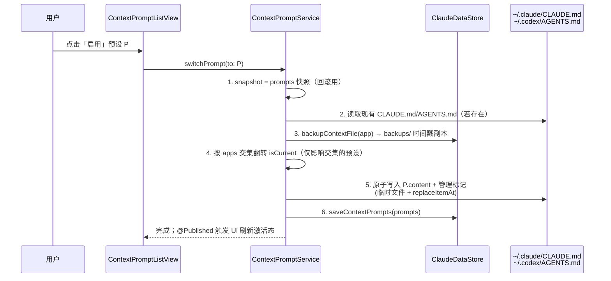

## Context

LaunchX 已具备完善的「Provider / MCP / Skills」管理体系，三者共享同一套设计范式：
- 统一数据模型 + `apps: Set<AppTarget>` 字段，让一条配置可作用于 Claude Code 和/或 Codex；
- `ClaudeProviderService`（`@MainActor ObservableObject` 单例）作为唯一事实源，`@Published var providers`；
- `ClaudeDataStore` 以原子写 JSON 落盘到 `~/Library/Application Support/LaunchX/claude/`；
- 切换时执行固定流程：快照 → backfill → 备份 → 按 `apps` 交集翻转 `isCurrent` → 写入实际 CLI 配置文件 → 持久化。

但「全局上下文提示词」目前完全空白——应用从不读写 Claude Code 的 `~/.claude/CLAUDE.md` 和 Codex 的 `~/.codex/AGENTS.md`。用户要在不同场景（默认编码、严格审查、中文沟通、特定框架专家…）间切换「全局上下文」时，只能手动编辑这两个 Markdown 文件，无法保存多套、无法一键切换、容易误覆盖。

本设计目标：**复刻 Provider 的管理/切换范式**，新增「上下文预设」能力，让用户像切换 Provider 一样切换全局上下文提示词。

## Goals / Non-Goals

**Goals:**
- 新增 `ContextPrompt` 数据模型，结构与 `ClaudeProvider` 对齐（含 `apps`、`isCurrent`、向后兼容解码）
- 支持 Claude 和 Codex 各自独立激活、也可一条预设同时作用于两者（完全沿用 Provider 的 `apps` 交集切换算法）
- 切换激活预设时，原子写入 `~/.claude/CLAUDE.md` 和/或 `~/.codex/AGENTS.md`，写入前必须备份原文件
- 提供内置预设库 + 完整 CRUD（新增 / 编辑 / 删除 / 复制 / 排序）
- 在两个设置面板各新增「上下文」标签页，UI 对齐现有 Provider 列表 / 预设选择器 / 编辑表单

**Non-Goals:**
- 不修改任何现有 Provider / MCP / Skills 的需求与行为（纯新增能力）
- 不实现「项目级」上下文（如项目根目录的 `CLAUDE.md` / `AGENTS.md`），仅管理用户级全局文件
- 不与 Provider 切换耦合（切换 Provider 不会重写上下文文件，反之亦然）
- 不做 Markdown 富文本编辑器，正文用纯 `TextEditor` 录入
- 不做云端同步 / 多设备共享（本期范围外）

## Decisions

### 决策 1：统一模型 + `apps` 字段（对齐 Provider 范式）

**选择**：单一 `ContextPrompt` 模型 + `apps: Set<AppTarget>`，复刻 `ClaudeProvider`。

**理由**：
- 与现有 Provider / MCP / Skills 完全一致，降低认知与维护成本
- `apps` 交集切换算法天然支持「Claude 和 Codex 各激活不同预设」（apps={claude} 与 apps={codex} 的两条预设可同时 `isCurrent`），也支持「一条预设同时作用于两者」

**备选方案**：为 Claude 和 Codex 分别建两套模型/服务。**否决**：违反既有 `apps` 范式，重复代码，无法表达「一条上下文同时给两个工具用」。

### 决策 2：切换算法完全对齐 `switchProvider(to:)`

`ContextPromptService.switchPrompt(to:)` 复用 `ClaudeProviderService` 的 8 步流程（去掉末尾的 MCP/Skills 同步，因上下文不涉及）：



- 步骤 4 的关键：`if !prompts[i].apps.intersection(targetApps).isEmpty { prompts[i].isCurrent = (prompts[i].id == P.id) }`
- 步骤 5 若抛错 → 用 snapshot 回滚内存状态并向上抛出（对齐 `ProviderSwitchError` 模式，新增 `ContextSwitchError`）
- `currentClaudePrompt` / `currentCodexPrompt` 计算属性 = `prompts.first { $0.isCurrent && $0.apps.contains(.claude/.codex) }`

### 决策 3：全文件所有权 + 管理标记 + 强制备份

CLAUDE.md / AGENTS.md 语义上就是「全局指令文件」，本功能即「切换全局上下文」，因此采用**全文件所有权**（非 managed-section 标记段）。

**安全措施**：
- 写入时追加一个不可见的管理标记（HTML 注释，Markdown 合法、渲染不可见、CLAUDE.md 与 AGENTS.md 通用）：

  ```
  <!-- managed-by: launchx-context-prompt; id: <UUID> -->
  ```

  放在文件**末尾**。作用：(a) 让 LaunchX 识别「此文件由我管理」，(b) 记录来源预设 id，便于「取消管理 / 还原」。
- **首次接管前**：若目标文件已存在且**不含**管理标记（即用户手写内容），写入前必须先备份到 `backups/CLAUDE.md.<timestamp>.bak`，绝不静默覆盖。
- 含管理标记的文件视为 LaunchX 已接管，切换时直接替换内容（仍记录备份，便于撤销）。

**备选方案**：managed-section 标记段（类似 Codex shell env 的 `# >>> LaunchX Codex >>>`）。**否决**：CLAUDE.md/AGENTS.md 是整文件语义，分段会让「全局上下文」与用户其他内容混杂，切换效果不彻底，违背用户「设定全局上下文」的诉求。保留「取消管理」入口让用户可随时退出全文件所有权。

### 决策 4：持久化与原子写入

- `context_prompts.json`：经 `ClaudeDataStore` 通用 `writeJSON`/`readJSON`（temp + `replaceItemAt`），对齐 `providers.json`。
- 指令文件写入：对齐 `writeClaudeSettings` 的「写临时文件 → `replaceItemAt`（存在）或 `moveItem`（不存在）」原子写法。

### 决策 5：UI 复刻 Provider 标签页

- `ClaudeCodeTab` 与 `CodexMainTab` 各新增 `.context` case（插在 `.providers` 之后或末尾）。
- `ContextPromptListView`（仿 `ProviderListView`）：按 `apps` 过滤、`LazyVStack` 行视图、激活徽标 + 「启用」按钮 + 编辑/删除/复制。
- `ContextPromptPresetView`（仿 `ProviderPresetView`）：内置预设分组画廊，一键创建。
- `ContextPromptFormView`（仿 `ProviderFormView`）：名称 `TextField` + 应用选择器 + Markdown `TextEditor`（正文）。

## Risks / Trade-offs

- **[风险] 全文件所有权可能覆盖用户精心维护的 CLAUDE.md/AGENTS.md** → **缓解**：首次接管非托管文件前强制备份到 `backups/`；UI 提供「取消管理 / 还原」入口；管理标记让来源可追溯。
- **[风险] 用户在 LaunchX 外手动改了 CLAUDE.md，切换时会被覆盖** → **缓解**：与 Provider 的 backfill 类比——切换前若文件含管理标记，可读取其当前正文回填到对应预设（作为 backfill 体验的后续增强，本期至少保证备份不丢失）。
- **[风险] 一条预设 apps={claude,codex} 同时激活时，与「Claude/Codex 各自独立激活」语义冲突** → **缓解**：`apps` 交集算法已天然处理——切换该预设会同时取消两侧当前激活项；行为可预测，UI 用激活徽标明示。
- **[取舍] 正文仅纯文本编辑** → 非目标，避免引入富文本依赖；`TextEditor` 足够，未来可演进。
- **[风险] 管理标记被用户/其他工具误删** → **缓解**：标记缺失时按「用户手写」处理（触发备份后再写），不会因标记缺失而崩溃或静默覆盖。

## Migration Plan

1. 新增模型 / 服务 / 视图代码，编译通过即可上线；旧版本数据不受影响（全新文件 `context_prompts.json`）。
2. 首次启动若 `context_prompts.json` 不存在 → 初始化为内置预设或空数组（不自动激活、不触碰 CLAUDE.md/AGENTS.md）。
3. 用户首次「启用」某预设时才触发对全局指令文件的读写；此前的 CLAUDE.md/AGENTS.md 保持原样。
4. 回滚：删除新增代码 + `context_prompts.json`；已写入的全局指令文件可通过 `backups/` 手动还原（或删除管理标记后保留内容）。

## Open Questions

- 内置预设的具体清单与默认正文（建议：默认编码助手、严格代码审查、中文沟通优先、React/Swift 专家等）——可在 tasks 阶段定稿。
- 是否需要在「取消管理」时把当前文件正文反向导入为一条用户预设，便于无缝退出全文件所有权。
- 管理标记是否需要带版本号字段，以便未来调整标记格式时平滑识别旧标记。
